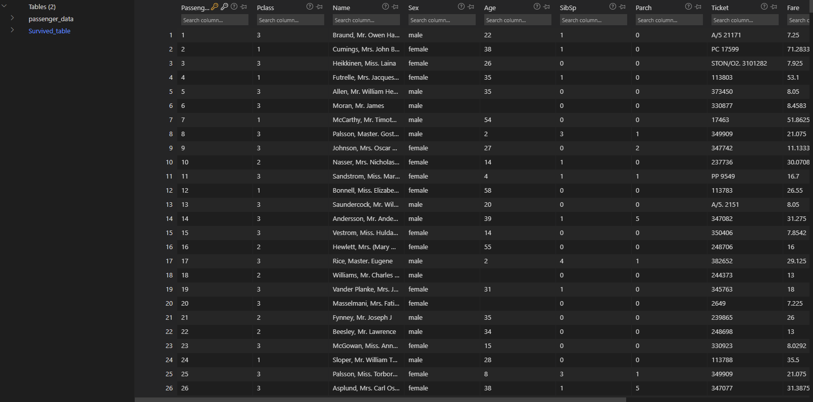
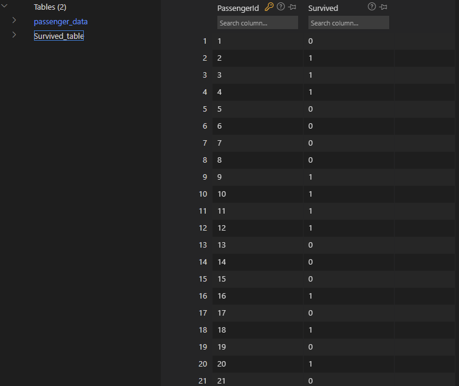

# Segment 1 Presentation  

## Selected topic
Titanic - Machine Learning from Disaster. 

## Reason why they selected their topic
One of the most popular topic on Kaggle, as they describe this is the "the best, first challenge for you to dive into machine learning"

## Description of their source of data
Data has 891 unique Value, with information ie name, age, gender, socio-economic class, etc.

| Variable     | Definition                                 | Key                                            |
| --------     |  ---------                                 | ----------------------------                   |
| survival     | Survival                                   | 0 = No, 1 = Yes                                |
| pclass	   | Ticket class	                            |1 = 1st, 2 = 2nd, 3 = 3rd                       |
| sex	       | Sex                                        |                                                |	
| Age	       | Age in years                               |                                                |	
| sibsp	       | # of siblings / spouses aboard the Titanic	|                                                |
| parch	       | # of parents / children aboard the Titanic	|                                                |
| ticket       | Ticket number	                            |                                                |
| fare         | Passenger fare	                            |                                                |
| cabin        | Cabin number	                            |                                                |
| embarked     | Port of Embarkation	                    | C = Cherbourg, Q = Queenstown, S = Southampton |

## Questions they hope to answer with the data
with the data, we hope to find out:
"what sorts of people were more likely to survive?"

---

# Segment 2

Goal for this Final Project:
My team will work on a example of an analysis of the Titanic disaster in Python using a full complement of PyData utilities and SQLAlchemy.

This Final project will show basic examples of:
* Data Handling
* Importing Data with Pandas
* Cleaning Data
* Manipulate Data via SQLite3
* Exploring Data through Visualizations with Matplotlib
* Merage two CSV files into one DataBase
---

## Machine Learning Model

•	Description of preliminary data preprocessing
The Titanic shipwreck was a massive disaster, so we will implement data pre- processing on this data set to know the number of survivors and their details, and the relationship between their social-status,age,gender and other factors, and find the correlation between them and rate of thier survival rate. 
First, In our case we chose to load data with pandas,we start off by importing all the data into our system, training data set and testing data set are given by Kaggle and we will download from Kaggle, these two Data sets being merage into one 'titanic_test.db' file, we inteding to taking the sql query and putting it into a dataframe. We first Connecting to the database, running our SQL query against the database that connected and Iterating through the query.description.  Pulling out the each element if its needed, then making a dataframe from the query and columns. And we will be dropping columns that don’t contribute much to our model such as “name, ticket, cabin etc.” If needed, we can drop the rows with missing values (NaN). We then convert “Pclass, Sex, Embarked values” into columns, dropping the same columns from the data frame. To handle the missing value, age, we compute a median of all the ages. Jumping into splitting the data set into training set and test set The dataset is split 70% training and 30% test.

•	Description of preliminary feature engineering and preliminary feature selection, including the decision-making process
Feature preliminary engineering includes titles, deck, family size, age* classification, and fare per person, the decision-makeing process is based on the avaliability of these public data/features and correlation between these preliminary feature with the rate of survival. 

•	Description of how data was split into training and testing sets
 For the training set was based on “features” like passengers’ gender and class., we provide the outcome for each passenger
 For the test set, we do not provide the ground truth for each passenger. We predict these outcomes. For each passenger in the test set, use used the model to predict
 whether they survived the sinking of the Titanic
  
•	Explanation of model choice, including limitations and benefits
  among many models and dependencies that are available, we chose pandas,sqlite3 and numpy these three for the preliminary stage, we'll import more if needed in later stage of the project, we choose pandas because Pandas is a Python library for manipulating data that will fit in memory, it was one of the most common used dependcy we used through out our class, and it represent and organize data super well, so even the limitations of the pandas is it does not persist data well, the benefits still overweight the limitation of pandas. We also use sqlite3 because SQLite is a very light weighted database that we did learn and get somewhat familiar with. eventhough it is limitated and Database size is restricted small in most cases, but since the Titanic data set is not gigantic so it's a perfect choice for our Final project.

## Database

• [titanic_test.db](titanic_data/titanic_test.db)

• The Database we created contant two tables which are 'passenger_data'  and 'Survived_table'.

• In the python file  [How_to_read_sqlite](titanic_data/How_to_read_sqlite.ipynb) we use sqlite3 and pandas to join/merge two tables.

## Dashboard
* https://public.tableau.com/app/profile/yanyi.jiao/viz/Titanicworkbook_16589682966610/Dashboard1

## Machine Learning Final 

*	Create dataframe by merging database with python
* Use original csv for exploratory analysis, creating multiple charts based on genders, classes, ages
*	Process and transform these variables so that the data becomes manageable by a machine learning algorithm.
* Process text variables like the passenger names and integrate this information in our model.
*	Break the combined dataset in train set and test set.
*	Use the train set to build a predictive model.
* Evaluate the model using the train set.
* Test the model using the test set and generate and output file for the submission.
